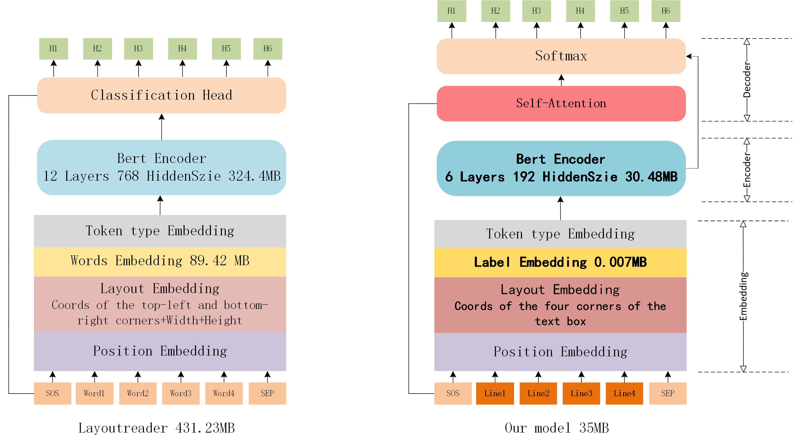

# Introduce
Line-Level Reading Order Detection Based on BERT

## Functions
* This algorithm can reorder unordered sequences of text lines extracted from structurally complex text images, even those with skewed text images. Compared to other algorithms, this approach has lower complexity and produces a reconstructed order that more closely aligns with human reading habits.
* This model mainly consists of three parts: input embedding layer, encoder, and decoder. The embedding layer receives the four vertex coordinates of the text bounding boxes and text attributes as input information. The encoder uses a bidirectional encoding Bert to extract features of the unordered text lines. Finally, a fully connected network with a self-attention mechanism is used as the decoder to predict the text line sequence step by step.

## Model Architecture

## Show

## Env set
* cuda               11.8
* python             3.8.0
* conda create --name linereader python=3.8.0
* Detail please reference requierment.txt

## About author
* warren@伟
* Blog：[CSDN](https://blog.csdn.net/warren103098?type=blog)
